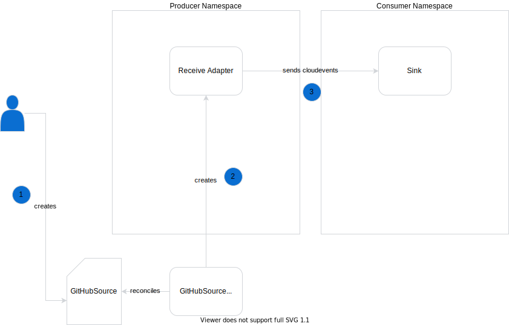
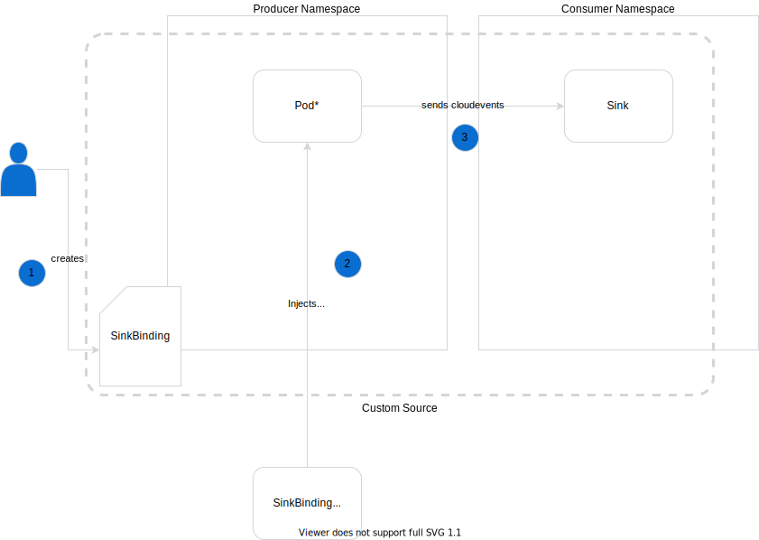

Knative event sources introduced a way to link event producers to an in-cluster _event sink_ using a custom CRD. Typically, event source authors provide a custom CRD (e.g.`GitHubSource`), a controller that reconciles on provided CRD, and a receive adapter component which understand how to forward the events from the producer to the sink. 
   


A SinkBinding provides a framework for injecting `K_SINK` (destination address) and `K_CE_OVERRIDES` (JSON cloudevents attributes) 
environment variables into any Kubernetes resource which has a `spec.template` that looks like a Pod (aka PodSpecable).


### Prerequisites
- Install [ko](https://github.com/google/ko)
- Set `KO_DOCKER_REPO`
 (e.g. `gcr.io/[gcloud-project]` or `docker.io/<username>`)
- Authenticated with your `KO_DOCKER_REPO`
- Install [`docker`](https://docs.docker.com/install/)

## Installation

The SinkBinding type is enabled by default when you install Knative Eventing.

## Example

This example shows the SinkBinding that injects`$K_SINK` and `$K_CE_OVERRIDES` into select `Jobs` and direct events to the Event Display Service.

### Prepare the heartbeats image
Knative [event-sources](https://github.com/knative/eventing-contrib) has a
sample of heartbeats event source. You could clone the source codes by

```
git clone -b "" https://github.com/knative/eventing-contrib.git
```

And then build a heartbeats image and publish to your image repo with

```
ko publish knative.dev/eventing-contrib/cmd/heartbeats
```

### Creating a namespace

Create a new namespace called `sinkbinding-example` by entering the following
command:

```shell
kubectl create namespace sinkbinding-example
```

### Creating the Event Display Service

In this step, you create one event consumer, `event-display` to verify that
`SinkBinding` is properly working.

To deploy the `event-display` consumer to your cluster, run the following
command:

```shell
kubectl -n sinkbinding-example apply -f - << EOF
apiVersion: apps/v1
kind: Deployment
metadata:
  name: event-display
spec:
  replicas: 1
  selector:
    matchLabels: &labels
      app: event-display
  template:
    metadata:
      labels: *labels
    spec:
      containers:
        - name: event-display
          image: gcr.io/knative-releases/knative.dev/eventing-contrib/cmd/event_display

---

kind: Service
apiVersion: v1
metadata:
  name: event-display
spec:
  selector:
    app: event-display
  ports:
  - protocol: TCP
    port: 80
    targetPort: 8080
EOF
```

### Creating the SinkBinding

In order to direct events to our Event Display, we will first create a
SinkBinding that will inject `$K_SINK` and `$K_CE_OVERRIDES` into select `Jobs`:


{}

```shell
kubectl -n sinkbinding-example apply -f - << EOF
apiVersion: sources.knative.dev/v1beta1
kind: SinkBinding
metadata:
  name: bind-heartbeat
spec:
  subject:
    apiVersion: batch/v1
    kind: Job
    selector:
      matchLabels:
        app: heartbeat-cron

  sink:
    ref:
      apiVersion: v1
      kind: Service
      name: event-display
  ceOverrides:
    extensions:
      sink: bound
EOF
```



{}

```shell
kn source binding create bind-heartbeat \
  --namespace sinkbinding-example \
  --subject "Job:batch/v1:app=heartbeat-cron" \
  --sink http://event-display.svc.cluster.local \
  --ce-override "sink=bound"
```




In this case, we will bind any `Job` with the labels `app: heartbeat-cron`.

### Creating the CronJob

Now we will use the heartbeats container to send events to `$K_SINK` every time
the CronJob runs:

```shell
kubectl -n sinkbinding-example apply -f - << EOF
apiVersion: batch/v1beta1
kind: CronJob
metadata:
  name: heartbeat-cron
spec:
  # Run every minute
  schedule: "* * * * *"
  jobTemplate:
    metadata:
      labels:
        app: heartbeat-cron
    spec:
      template:
        spec:
          restartPolicy: Never
          containers:
            - name: single-heartbeat
              # This corresponds to a heartbeats image uri you build and publish in the previous step
              # e.g. gcr.io/[gcloud-project]/knative.dev/eventing-contrib/cmd/heartbeats
              image: <heartbeats_image_uri>
              args:
                - --period=1
              env:
                - name: ONE_SHOT
                  value: "true"
                - name: POD_NAME
                  valueFrom:
                    fieldRef:
                      fieldPath: metadata.name
                - name: POD_NAMESPACE
                  valueFrom:
                    fieldRef:
                      fieldPath: metadata.namespace
EOF
```


### Verify

View the logs for the `event-display` event consumer by
entering the following command:

```shell
kubectl -n sinkbinding-example logs -l app=event-display --tail=200
```
You should see log lines showing the request headers and body of the event
message sent by the heartbeats source to the display function:


```shell
☁️  cloudevents.Event
Validation: valid
Context Attributes,
  specversion: 1.0
  type: dev.knative.eventing.samples.heartbeat
  source: https://knative.dev/eventing-contrib/cmd/heartbeats/#default/heartbeat-cron-1582120020-75qrz
  id: 5f4122be-ac6f-4349-a94f-4bfc6eb3f687
  time: 2020-02-19T13:47:10.41428688Z
  datacontenttype: application/json
Extensions,
  beats: true
  heart: yes
  the: 42
Data,
  {
    "id": 1,
    "label": ""
  }
```

### Cleanup

Delete the `sinkbinding-example` namespace and all of its resources from your
cluster by entering the following command:

```shell
kubectl delete namespace sinkbinding-example
```

## Reference Documentation

See the [SinkBinding specification](../../reference/eventing/#sources.knative.dev/v1beta1.SinkBinding).

## Contact

For any inquiries about this source, please reach out on to the
[Knative users group](https://groups.google.com/forum/#!forum/knative-users).
